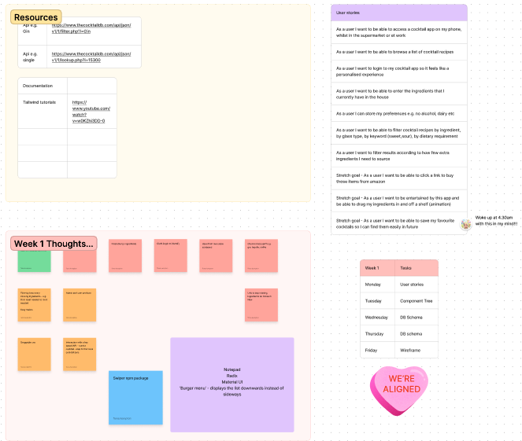

## Setup instructions

Clone the repo: git clone https://github.com/than2042/infuse.it

Run: npm install

```bash
npm run dev
# or
yarn dev
# or
pnpm dev
# or
bun dev
```

- Create a .env.local file in the root directory and add the following environment variables:
- DATABASE_URL - the URL of your Postgres database (eg. the Supabase connection string)
- NEXT_PUBLIC_CLERK_PUBLISHABLE_KEY
- CLERK_SECRET_KEY

* NEXT_PUBLIC_CLERK_SIGN_IN_URL=/sign-in
* NEXT_PUBLIC_CLERK_SIGN_UP_URL=/sign-up
* NEXT_PUBLIC_CLERK_AFTER_SIGN_IN_URL=/
* NEXT_PUBLIC_CLERK_AFTER_SIGN_UP_URL=/

Open [http://localhost:3000](http://localhost:3000) with your browser to see the result.

You can start editing the page by modifying `app/page.js`. The page auto-updates as you edit the file.

This project uses [`next/font`](https://nextjs.org/docs/basic-features/font-optimization) to automatically optimize and load Inter, a custom Google Font.

## Project Planning


## Page & components


## User Story



## Data Table


## Deploy on Vercel

The easiest way to deploy your Next.js app is to use the [Vercel Platform](https://vercel.com/new?utm_medium=default-template&filter=next.js&utm_source=create-next-app&utm_campaign=create-next-app-readme) from the creators of Next.js.

Check out our [Next.js deployment documentation](https://nextjs.org/docs/deployment) for more details.
